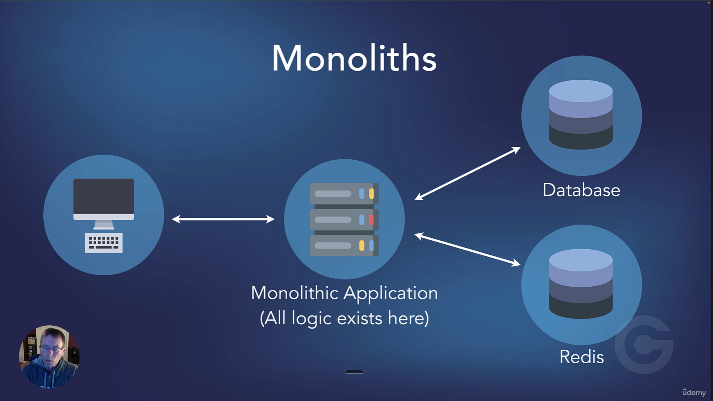
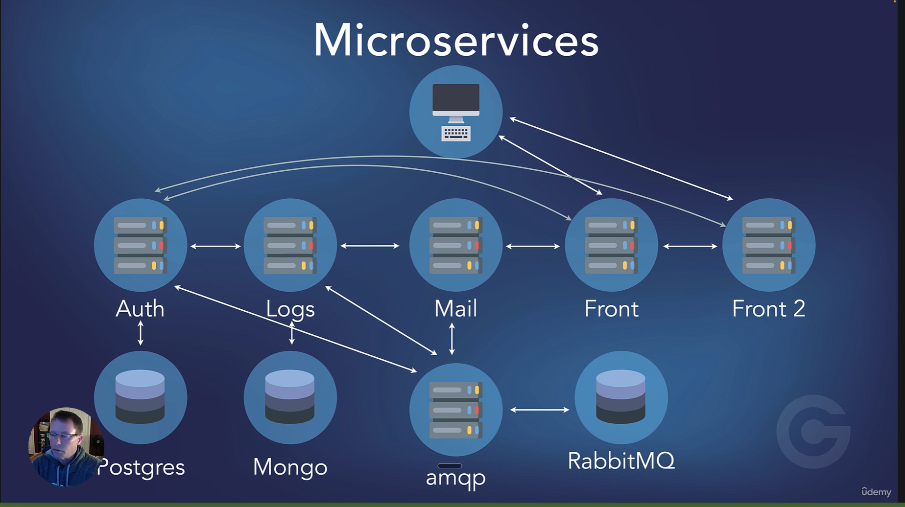

### Microservices
- Monlithic applications
- Distributed applications
- Microservices
- Do one thing, and do it well - the Unix philosophy

- Communicate via JSON/REST, RPC (Remote Procedure call), gRPC (faster then RPC) and over a messaging queue 

### Monoliths

Everything is handled by one application
- User authentication
- Sending Email
- Logging 
- All business logic

### What we'll build

A front end web application that connects 5 microservices

- Broker : optional single point of entry to microservices
- Authentication : Postgress
- Logger - MongoDB
- Mail - send email with a specific template
- Listener - consumes message in RabbitMQ and intiates a process

