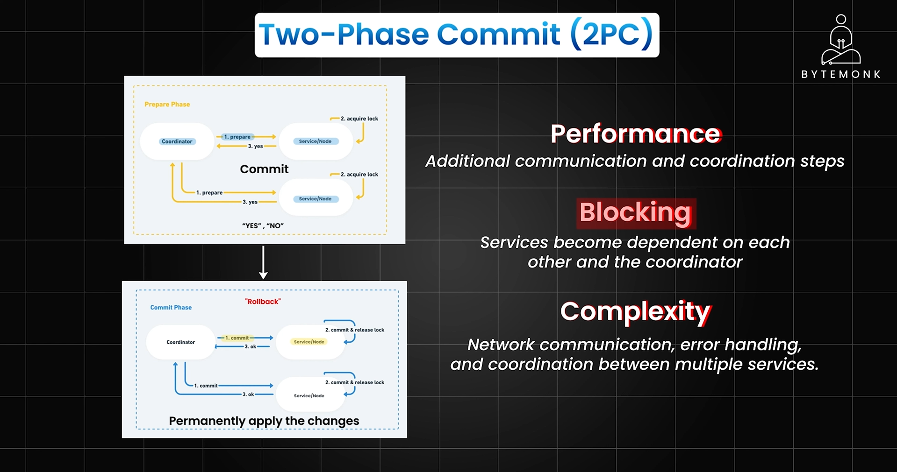
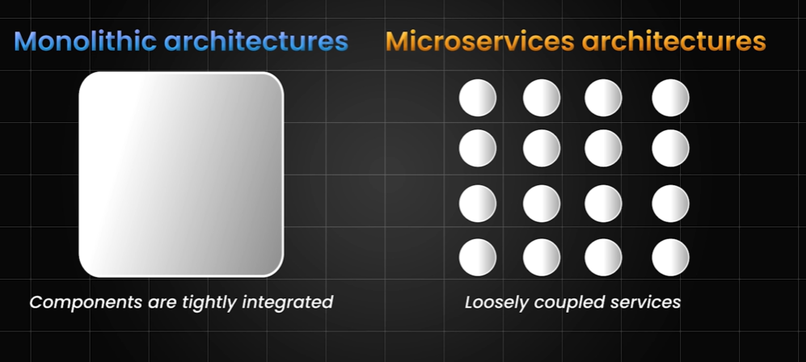
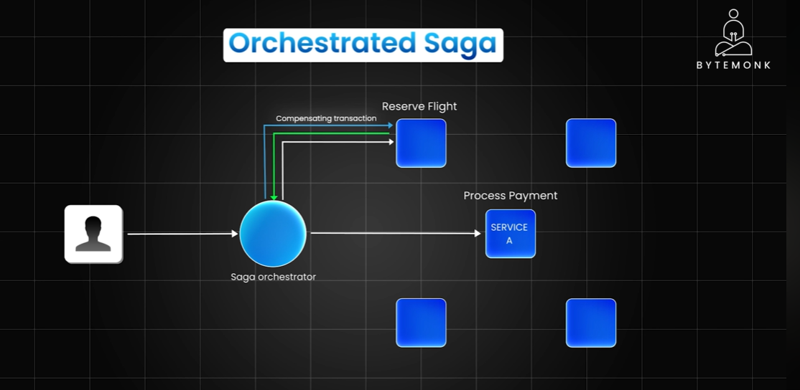
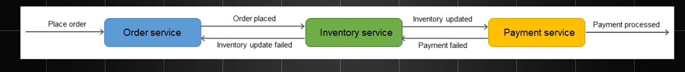
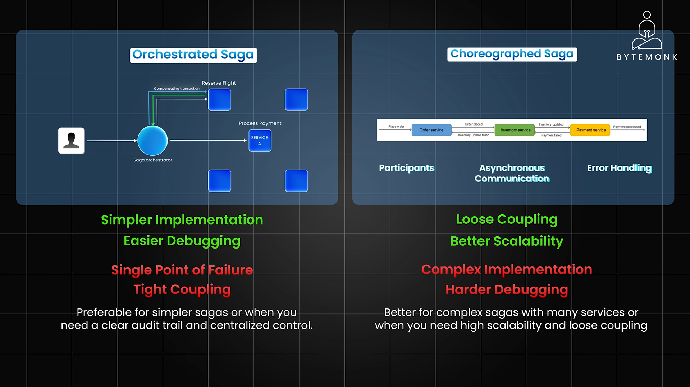
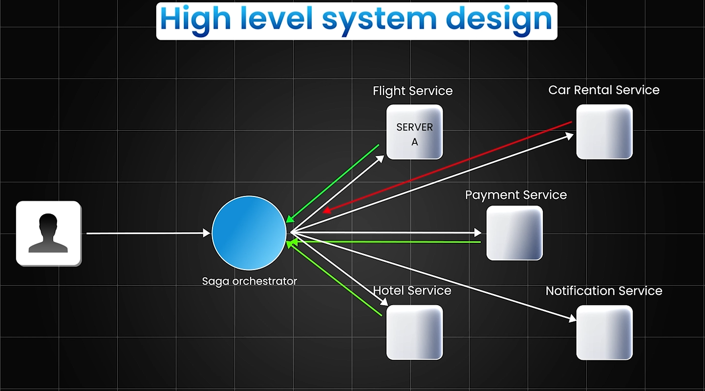
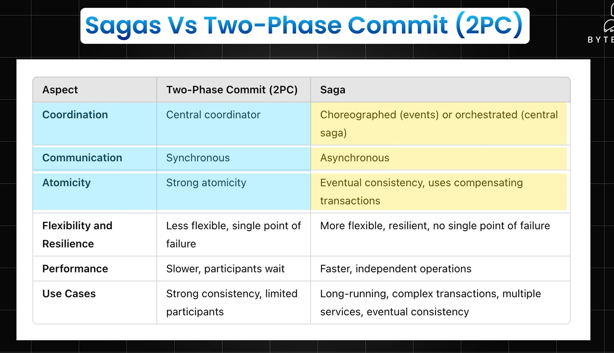

# Saga Pattern

## TL;DR
> In microservices, you can't use a single database transaction across multiple services. The **Saga Pattern** breaks a big operation into a sequence of smaller, independent **local transactions** — each handled by one service. If any step fails, **compensating transactions** undo the previous steps. There are two ways to coordinate this: **Orchestration** (a central controller tells each service what to do) and **Choreography** (services react to each other's events independently).

---

## The Problem — Why Do We Even Need This?

Imagine you're building a **flight booking system**. When a user books a flight, you need to:

1. Reserve a seat on the flight
2. Deduct money from their account
3. Book a car rental
4. Send a confirmation email

In a traditional monolith with a single database, all four steps happen in **one transaction** — either all succeed or all fail. That's easy.

But in microservices, each of these steps lives in a **separate service with its own database**:

```
Flight Service  -->  its own DB
Payment Service -->  its own DB
Car Service     -->  its own DB
Email Service   -->  its own DB
```

You **cannot** run a single database transaction across multiple databases. So what do you do?

---

## Distributed Transactions — The Goal

The goal is still the same: **all operations succeed together, or fail together**.

This property comes from **ACID**:

| Property | Meaning |
|---|---|
| **A**tomic | All or nothing — either every step completes, or none do |
| **C**onsistent | Data is always in a valid state before and after |
| **I**solated | Transactions don't interfere with each other |
| **D**urable | Once committed, data is saved even if the system crashes |

The challenge is achieving this when your data is spread across multiple services.

---

## Common Solutions

### 1. Two-Phase Commit (2PC)

**Used by:** Zookeeper, Google Spanner

The idea: have a **coordinator** ask all services if they're ready, then tell them all to commit at the same time.

**How it works:**

**Phase 1 — Prepare:**
- Coordinator sends a "prepare" message to all services
- Each service locks its resources and replies "ready" or "abort"

**Phase 2 — Commit:**
- If everyone said "ready" → coordinator sends "commit" to all
- If anyone said "abort" → coordinator sends "rollback" to all





**Problems with 2PC:**
- **Blocking** — if the coordinator crashes after Phase 1, all services are stuck holding locks
- **Slow** — requires multiple round-trips and locks across services
- **Not practical** for most microservice setups

---

### 2. Sagas

The Saga Pattern is the modern, microservice-friendly solution.

**Core idea:** Break the big transaction into a sequence of **local transactions**, one per service. Each local transaction updates only its own database and then fires an **event** to trigger the next step.

**Example — Flight Booking Saga:**

```
Step 1: Flight Service  → Reserve seat        → emits "SeatReserved" event
Step 2: Payment Service → Charge customer      → emits "PaymentDone" event
Step 3: Car Service     → Book car rental      → emits "CarBooked" event
Step 4: Email Service   → Send confirmation    → emits "EmailSent" event
```

**What if something fails?**

If Step 3 (Car Service) fails, you must undo Steps 1 and 2. These are called **compensating transactions**:

```
Compensating Step 2: Payment Service → Refund customer
Compensating Step 1: Flight Service  → Cancel seat reservation
```

> Think of compensating transactions as the "undo" button for each step.

---

## Two Ways to Implement Sagas

### Orchestrated Saga (Centralized Control)

A central **Orchestrator** (also called a Saga Manager) tells each service what to do and what to do next.

```
                    ┌─────────────────┐
                    │   Orchestrator  │
                    └────────┬────────┘
                             │
          ┌──────────────────┼──────────────────┐
          ▼                  ▼                  ▼
   Flight Service     Payment Service     Car Service
```

- Orchestrator sends commands: "Reserve seat", "Charge payment", "Book car"
- Each service reports back success or failure
- Orchestrator decides what to do next (proceed or compensate)



**Pros:**
- Easy to understand — control flow is in one place
- Easy to add logging and monitoring
- Simple error handling — orchestrator handles all rollback logic

**Cons:**
- Orchestrator becomes a central point of failure
- Can feel like a "god object" that knows too much

---

### Choreography Saga (Event-Driven, Decentralized)

No central controller. Each service **listens for events** and reacts by doing its work and emitting the next event.

```
Flight Service  --[SeatReserved]-->  Payment Service
Payment Service --[PaymentDone]-->   Car Service
Car Service     --[CarBooked]-->     Email Service
```

- Services are loosely coupled — they only know about events, not each other
- If something fails, the service emits a failure event and others compensate



**Pros:**
- Truly decoupled — services don't call each other directly
- More resilient — no single point of failure
- Scales well

**Cons:**
- Harder to follow the overall flow (logic is spread across services)
- Harder to debug — you need good distributed tracing
- Risk of cyclic events if not designed carefully

---

## Orchestration vs Choreography — Quick Comparison





| | Orchestration | Choreography |
|---|---|---|
| **Control** | Central orchestrator | Distributed via events |
| **Coupling** | Services coupled to orchestrator | Services coupled only to events |
| **Visibility** | Easy — one place to look | Hard — logic is spread out |
| **Failure handling** | Orchestrator handles it | Each service handles its own |
| **Best for** | Complex flows with many steps | Simple, loosely-coupled flows |

---

## Sagas vs Two-Phase Commit



| | Two-Phase Commit (2PC) | Saga Pattern |
|---|---|---|
| **Consistency** | Strong (all-or-nothing) | Eventual (steps happen over time) |
| **Locking** | Locks resources across services | No locks needed |
| **Performance** | Slow (blocking) | Fast (async, non-blocking) |
| **Failure handling** | Coordinator handles rollback | Compensating transactions |
| **Use case** | Same-database or tightly coupled | Microservices with separate DBs |
| **Complexity** | Simple logic, complex infrastructure | More application-level logic needed |

> **Rule of thumb:** Use 2PC only if you're in a system that natively supports it (like a single distributed DB). For microservices, always prefer Sagas.

---

## Key Takeaways

1. **Microservices can't share a single database transaction** — each service owns its data.
2. **Sagas solve this** by chaining local transactions with compensating rollbacks on failure.
3. **Orchestration** = central controller, easy to reason about, single point of failure.
4. **Choreography** = event-driven, decoupled, harder to debug.
5. **Sagas trade strong consistency for availability and scalability** — which is usually the right call in distributed systems.
